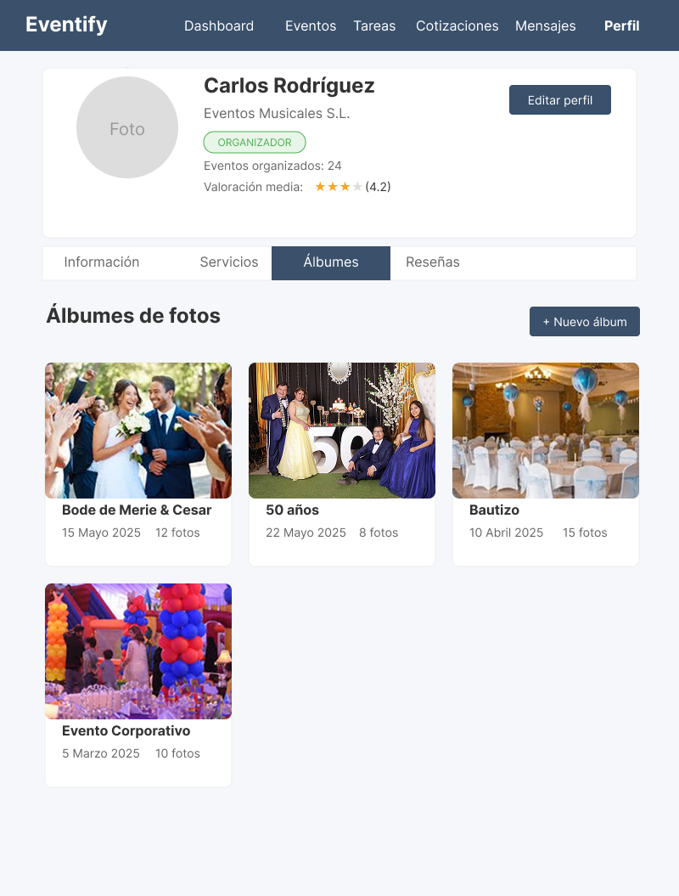

# Chapter IV: Product Design

## 4.1. Style Guidelines

### 4.1.1. General Style Guidelines
Esta sección presenta las decisiones visuales y comunicativas que definen la identidad de Eventify. Se explican aspectos clave como el uso del logo, la tipografía elegida, la paleta de colores, el sistema de espaciado y el tono de comunicación aplicado.

**Brand Overview**

La identidad visual de Eventify transmite claridad, organización y confianza desde el primer vistazo. El logo está compuesto por un ícono de calendario con un check en el centro, que representa la idea de tener un evento agendado y confirmado con éxito. A la derecha del ícono aparece el nombre de la marca en mayúsculas: **EVENTIFY**.

El color principal del logo es un tono verde claro y vibrante que destaca sobre distintos fondos, y que transmite frescura, dinamismo


**Typography**

La tipografía principal de Eventify es **Poppins**, una fuente sans-serif moderna y amigable que aporta claridad, equilibrio visual y un toque contemporáneo a la experiencia del usuario.

Elegida por su legibilidad y estética geométrica, Poppins permite mantener un diseño limpio, funcional y coherente en todos los tamaños de pantalla.


**Colors**

La paleta de colores de Eventify combina profesionalismo, frescura y dinamismo, reforzando el enfoque moderno y accesible de la plataforma.


* **Azul oscuro (#1C2541) / Azul medio (#3A506B)**: <br><br> Aplicados en la barra de navegación, el footer y fondos de secciones principales. Estos tonos transmiten confianza, estabilidad y orden, características clave para una plataforma de organización de eventos.


* **Blanco (#FFFFFF)**: <br><br> Utilizado como fondo neutro para alternar secciones, aporta limpieza visual y mejora la legibilidad de los contenidos.


* **Turquesa claro (#6FFFE9) y verde azulado (#5BC0BE)**: <br><br> Funcionan como colores de acento e interacción. Se emplean en los títulos de sección y al hacer hover sobre botones.

<br>

**Spacing**

La relación de espaciado utilizada, tanto en la aplicación como en la landing page, se basa en un múltiplo de 8 píxeles. Este sistema permite mantener una estructura visual ordenada y coherente en todo el diseño.


<br>

**Comunication Tone**

La comunicación está diseñada para ser cercana, clara y con un toque entusiasta, buscando conectar emocionalmente tanto con anfitriones como con organizadores de eventos, sin perder profesionalismo. Se adopta un lenguaje que guía, motiva y transmite confianza,

<br>

### 4.1.2. Web Style Guidelines

La interfaz web de Eventify está diseñada bajo principios de diseño responsive, garantizando una experiencia de usuario óptima en todos los dispositivos, desde smartphones hasta pantallas de escritorio. El objetivo es ofrecer una navegación fluida, intuitiva y visualmente coherente.

Para organizar el contenido se utilizó el patrón en Z, un esquema visual que guía naturalmente la mirada del usuario desde la parte superior izquierda hasta la inferior derecha, ideal para estructurar información de forma clara y persuasiva.


## 4.2. Information Architecture

### 4.2.1. Organization Systems

# Arquitectura de la Información de Eventify

Para estructurar la arquitectura de la información de **Eventify**, se ha adoptado un sistema de organización jerárquico tanto en la Landing Page como en la Aplicación Web. Este sistema facilita la navegación intuitiva y garantiza que los usuarios puedan encontrar fácilmente la información y las funciones que necesitan.

## Landing Page

La Landing Page de **Eventify** se organiza de manera jerárquica para que los usuarios puedan acceder rápidamente a la información más relevante y a las acciones necesarias para interactuar con la plataforma:

### Barra de Navegación Principal

Situada en la parte superior de la página, proporciona accesos rápidos a las secciones clave:

- **Inicio (Home):** La página de inicio que da la bienvenida a los usuarios y proporciona una visión general de los servicios de Eventify. Incluye un banner destacado con un mensaje central y botones de llamada a la acción para el registro e inicio de sesión.
- **Servicios (Services):** Presenta los servicios ofrecidos tanto para anfitriones de eventos como para organizadores profesionales. Esta sección está organizada para que cada tipo de usuario pueda identificar rápidamente cómo Eventify puede beneficiarles.
- **Planes (Plans):** Explica las diferentes opciones de planes disponibles para usuarios y organizadores, incluyendo características y beneficios de cada uno. Esta sección facilita la comparación y selección de la mejor opción.
- **Contáctanos (Contact Us):** Proporciona información de contacto, un formulario de consulta y enlaces a redes sociales, facilitando la comunicación entre los usuarios y el equipo de soporte de Eventify.
- **Nosotros (About Us):** Describe la misión, visión y el equipo detrás de Eventify, generando confianza y transparencia con los usuarios.

### Estructura de Contenido Jerárquica

- **Encabezados y Subencabezados:** Organizan el contenido dentro de cada sección, permitiendo a los usuarios explorar más a fondo según sus intereses.
- **Botones de Llamada a la Acción (CTAs):** Colocados estratégicamente para guiar a los usuarios hacia acciones deseadas como crear un evento, contratar un organizador o contactar al equipo de Eventify.

### Footer

Incluye enlaces a secciones importantes como políticas de privacidad, términos de servicio, contacto y enlaces a redes sociales. El footer proporciona una navegación adicional para usuarios que desean explorar más sobre Eventify.


## Aplicación Web

La Aplicación Web de **Eventify** está diseñada para ofrecer una experiencia personalizada para dos segmentos principales de usuarios: **Anfitriones de Eventos** y **Organizadores Profesionales**. La organización del contenido permite que cada tipo de usuario navegue eficientemente por la aplicación.

### Para Anfitriones de Eventos

- **Buscar Organizador (Search Organizer):** Permite a los anfitriones buscar organizadores de eventos según diferentes criterios, como tipo de evento, ubicación y presupuesto.
- **Mis Eventos (My Events):** Muestra una lista de eventos programados por el anfitrión, permitiendo ver detalles, asistentes y organizadores asignados.
- Cotizaciones (Quotes): Permite a los anfitriones recibir y gestionar cotizaciones de organizadores, facilitando la comparación de precios y servicios ofrecidos.
- **Mensajes (Messages):** Facilita la comunicación directa entre anfitriones y organizadores, permitiendo el intercambio de información y actualizaciones sobre eventos.
- **Reseñas (Reviews):** Permite a los anfitriones dejar reseñas y calificaciones sobre organizadores, ayudando a otros usuarios a tomar decisiones informadas.
- **Perfil (Profile):** Permite a los anfitriones gestionar su información personal, preferencias de notificación y configuración de cuenta.
- **Configuración:** Permite a los anfitriones ajustar sus preferencias de notificación, privacidad y otros aspectos de su cuenta.

### Para Organizadores Profesionales

- **Mensajes (Messages):** Facilita la comunicación directa entre anfitriones y organizadores, permitiendo el intercambio de información y actualizaciones sobre eventos.
- **Cotizaciones (Quotes):** Permite a los anfitriones recibir y gestionar cotizaciones de organizadores, facilitando la comparación de precios y servicios ofrecidos.
- **Perfil (Profile):** Permite a los anfitriones gestionar su información personal, preferencias de notificación y configuración de cuenta.
- **Suscripción (Subscription):** Muestra el estado de la suscripción del anfitrión, incluyendo opciones de pago y renovación.
- **Tareas (Tasks):** Permite a los anfitriones gestionar tareas relacionadas con la planificación de eventos, asignando responsabilidades y fechas límite.
- **Eventos (Events):** Muestra una lista de eventos programados, permitiendo ver detalles, asistentes y organizadores asignados.
- **Calendario (Calendar):** Proporciona una vista de calendario con eventos programados, permitiendo a los anfitriones visualizar fechas y horarios de manera clara.
- **Dashboard:** Ofrece un resumen de los eventos activos, tareas pendientes, cotizaciones y mensajes recientes.


### Interacción y Flujo de Trabajo

- Las interfaces están diseñadas para ser intuitivas y fáciles de usar, permitiendo a los usuarios completar tareas rápidamente con un mínimo de pasos.
- Cada sección dentro de la aplicación está claramente etiquetada y utiliza una combinación de texto, íconos y ayudas visuales para mejorar la usabilidad y la comprensión.


### 4.2.2. Labeling Systems

# Sistemas de Etiquetado en Eventify (Web Application Angular)

En este apartado se describen los sistemas de etiquetado utilizados en la **Landing Page** y la **Aplicación Web** de **Eventify**, desarrollada con **Angular**.  
El etiquetado está diseñado para aprovechar Angular Components y Angular Material, garantizando fluidez y accesibilidad.

## Etiquetas de Encabezados (Headings)

Los encabezados principales se estructuran utilizando `mat-card`, `mat-toolbar` y `mat-expansion-panel`:

- **Inicio / Home:**  
  Página de bienvenida con `mat-toolbar` fija y sección de presentación usando `mat-card` para el contenido principal.

- **Eventos / Events:**  
  Listado de eventos en un `mat-grid-list` o `mat-list` con información básica y botones de acción.

- **Planes y Precios / Pricing Plans:**  
  Cards dinámicos (`mat-card`) para presentar las suscripciones disponibles.

- **Contáctanos / Contact Us:**  
  Formulario de contacto usando `mat-form-field`, `mat-input`, y `mat-button` para el envío.

- **Sobre Nosotros / About Us:**  
  Información organizacional estructurada en `mat-accordion` para una navegación simplificada.


## Etiquetas Textuales (Text Labels)

Las acciones están representadas principalmente en `mat-button`, `mat-icon-button` y etiquetas de formularios:

- **Buscar Eventos / Find Events:**  
  Barra de búsqueda con `mat-form-field` + `mat-icon` de búsqueda.

- **Registrarse / Register:**  
  Botón destacado `mat-raised-button color="primary"`.

- **Mis Eventos / My Events:**  
  Acceso a eventos propios desde `mat-sidenav` o sección principal.

- **Historial / History:**  
  Listado de eventos anteriores usando `mat-list` o `mat-table`.

- **Configuraciones / Settings:**  
  Sección en menú lateral (`mat-sidenav`) para ajustes de cuenta y notificaciones.


## Etiquetas Icónicas (Iconic Labels)

Angular Material usa íconos de la librería `@angular/material/icon`:

- **Icono de Búsqueda (search):** `<mat-icon>search</mat-icon>`
- **Icono de Calendario (event):** `<mat-icon>event</mat-icon>`
- **Icono de Estrella (star):** `<mat-icon>star</mat-icon>`
- **Icono de Ticket (confirmation_number):** `<mat-icon>confirmation_number</mat-icon>`
- **Icono de Notificación (notifications):** `<mat-icon>notifications</mat-icon>`

El enfoque en Angular garantiza una aplicación altamente dinámica y modular, donde cada componente gestiona su propia sección dentro de Eventify.


### 4.2.3. SEO Tags and Meta Tags

En el desarrollo de Eventify, la optimización para motores de búsqueda (SEO) juega un papel crucial para mejorar la visibilidad de la plataforma en línea. Los SEO tags y meta tags son herramientas esenciales que ayudan a los motores de búsqueda a comprender y clasificar el contenido de las páginas de la plataforma, asegurando que los usuarios encuentren Eventify de manera eficiente. Estos elementos permiten proporcionar información relevante, como el título de la página, la descripción, las palabras clave, y los datos específicos para mejorar la experiencia del usuario y atraer tráfico cualificado.

En este apartado, exploraremos los diferentes tipos de meta tags y SEO tags implementados en Eventify, cómo se utilizan para optimizar la indexación de nuestras páginas y las mejores prácticas que siguen los motores de búsqueda más utilizados.

####  Landing Page (Sitio Web Estático)

- **Title Tag: <br>**
El title tag es uno de los factores más importantes en SEO, ya que determina el título que aparece en los resultados de búsqueda. Por eso decidimos que sea breve, relevante y que contenenga las palabras clave para mejorar una mejor visibilidad.
```html
<title>Eventify - Conecta, organiza y celebra tus eventos</title>
```
- **Meta Description: Tag <br>**
La meta description proporciona un resumen conciso del contenido de la página. Es importante que sea atractiva y contenga palabras clave relevantes para aumentar la tasa de clicks en Eventify.
```html
<meta name="description" content="Eventify es la plataforma donde anfitriones encuentran al organizador ideal y organizadores hacen crecer su negocio. Conecta, organiza y celebra con confianza.">
```
- **Meta Keywords Tag: <br>**
El meta keywords tag es menos relevante hoy en día, pero aún es útil para proporcionar información adicional sobre el contenido de la página. En este caso, hemos incluido palabras clave relacionadas con la organización de eventos y la conexión entre anfitriones y organizadores.
```html
<meta name="keywords" content="eventos, organización, anfitriones, organizadores, bodas, celebraciones, gestión de eventos, planificación de eventos">
```
- **Meta Author Tag: <br>**
El meta author tag se utiliza para especificar el autor del contenido de la página. Aunque no impacta directamente en el SEO, lo consideramos útil para proporcionar transparencia y credibilidad.
```html
<meta name="author" content="Equipo Eventify">
```
- **Meta Viewport Tag: <br>**
  El Meta Viewport Tag es esencial para garantizar que el sitio se vea correctamente en dispositivos móviles. Asegura que la página sea responsiva, ajustando su escala según el tamaño de la pantalla del dispositivo. Decidimos implementarlo en Eventify para mejorar la experiencia del usuario en dispositivos móviles.
```html
<meta name="viewport" content="width=device-width, initial-scale=1.0">
```
- **Favicon: <br>**
  El favicon es el ícono que aparece en la pestaña del navegador. Es una forma sencilla de personalizar la apariencia de la página y mejorar la experiencia del usuario. Decidimos incluirlo en Eventify para ayudar a los usuarios a identificar nuestra plataforma de manera visual en múltiples pestañas.
```html
<link rel="icon" href="/assets/chapter-IV/eventify_logo.png" type="image/png">
```

### ⚙️ Web Application (Aplicación Web Interactiva)
- **Title Tag: <br>**
  El title tag define el título que aparecerá en el navegador y en los resultados de búsqueda cuando los usuarios interactúen directamente con la aplicación. Decidimos usar un título dinámico que refleje la acción principal del usuario en la aplicación Eventify.
```html
<title>Eventify - El aplicativo ideal para planificar tu evento</title>
```
- **Meta Description: <br>**
  La meta description proporciona un resumen conciso del contenido de la página. Es importante que sea atractiva y contenga palabras clave relevantes para aumentar la tasa de clicks en Eventify.
```html
<meta name="description" content="Organiza, coordina y conecta en un solo lugar. Con Eventify, gestiona eventos en tiempo real de manera rápida, sencilla y sin complicaciones.">
```
- **Meta Keywords Tag: <br>**
  El meta keywords tag es menos relevante hoy en día, pero aún es útil para proporcionar información adicional sobre el contenido de la página. En este caso, hemos incluido palabras clave relacionadas con la organización de eventos y la conexión entre anfitriones y organizadores.
```html
<meta name="keywords" content="gestión de eventos, mensajería, proformas, seguimiento del evento, anfitriones, organizadores, Eventify app">
```
- **Meta Author Tag: <br>**
  El meta author tag se utiliza para especificar el autor del contenido de la página. Aunque no impacta directamente en el SEO, lo consideramos útil para proporcionar transparencia y credibilidad.
```html
<meta name="author" content="Equipo Eventify">
```
- **Meta Viewport Tag: <br>**
  El meta viewport tag es fundamental para que la aplicación web sea responsiva. Asegura que Eventify se vea y funcione correctamente en dispositivos móviles, ajustando el contenido al ancho de la pantalla del usuario. Decidimos incluirlo para ofrecer una experiencia fluida en cualquier dispositivo.
```html
<meta name="viewport" content="width=device-width, initial-scale=1.0">
```

### 4.2.4. Searching Systems

El sistema de búsqueda en la aplicación web de Eventify ha sido diseñado para facilitar el acceso rápido a información clave, permitiendo a los usuarios encontrar contenido específico dentro de las distintas secciones de la plataforma de forma eficiente y ordenada.

El sistema de búsqueda está presente en las siguientes áreas:

- **Calendario:** los usuarios pueden buscar reuniones pendientes o próximas.

- **Cotizaciones:** se permite buscar cotizaciones específicas y aplicar filtros de orden cronológico (de la más antigua a la más reciente).

- **Eventos:** se pueden buscar eventos por nombre o por nombre del organizador, así como aplicar filtros por fecha.

- **Mensajes:** los usuarios pueden localizar conversaciones específicas mediante un campo de búsqueda.

- **Perfil del Organizador:** los organizadores pueden buscar dentro de sus propios eventos en la sección “Mis eventos”.

En todos los casos, el sistema responde a una acción de búsqueda explícita del usuario, es decir, los resultados se muestran una vez se presiona el botón "Buscar". Esto permite al usuario tener un mayor control sobre cuándo desea ver los resultados filtrados o refinados.

Este enfoque contribuye a una experiencia más ágil y centrada, permitiendo que tanto anfitriones como organizadores encuentren rápidamente lo que necesitan dentro de la aplicación Eventify.

### 4.2.5. Navigation Systems

En la aplicación web interactiva de Eventify, el sistema de navegación ha sido diseñado para guiar a los usuarios de manera intuitiva hacia las funciones clave de la plataforma, asegurando una experiencia clara, accesible y eficiente.

El sistema está compuesto por:

- **Un menú superior** que permite cambiar el idioma entre español e inglés, facilitando la accesibilidad a usuarios con diferentes preferencias lingüísticas.

- **Un menú lateral** persistente con accesos rápidos a las secciones principales de la aplicación: Dashboard, Calendario, Eventos, Tareas, Cotizaciones, Mensajes, Perfil y Suscripción.

- **Para garantizar la usabilidad en dispositivos móviles**, se ha implementado un menú hamburguesa que reemplaza el menú lateral en pantallas pequeñas, asegurando una navegación responsiva.

- **En cada sección, se utilizan botones flotantes y enlaces internos** que permiten al usuario realizar acciones específicas (como crear eventos, enviar mensajes o cargar proformas) sin salir de su flujo de trabajo.

Este sistema de navegación facilita que tanto anfitriones como organizadores accedan rápida y ordenadamente a todas las funcionalidades necesarias para planificar y gestionar sus eventos en Eventify.

## 4.3. Landing Page UI Design

### 4.3.1. Landing Page Wireframe
En esta sección se presentan las representaciones de bajo nivel **(wireframes)** del landing page, diseñadas para dispositivos móviles y de escritorio. [Wireframe - Eventify](https://www.figma.com/design/uPtLATLNkVL8P5xY7wBOc2/Eventify---Landing-page?node-id=0-1&t=yRuZCtcaOfFtQUmB-1)

**Desktop Web Browser**


<br>

**Mobile Web Browser**


### 4.3.2. Landing Page Mock-up

En esta sección se muestran los mock-ups del landing page, que sirven como una representación visual de alta fidelidad para anticipar cómo se verá y funcionará la interfaz final. Están diseñados tanto para dispositivos móviles como para escritorio. [Mock Ups - Eventify](https://www.figma.com/design/uPtLATLNkVL8P5xY7wBOc2/Eventify---Landing-page?node-id=0-1&t=yRuZCtcaOfFtQUmB-1)

**Desktop Web Browser**


<br>

**Mobile Web Browser**


## 4.4. Web Applications UX/UI Design

### 4.4.1. Web Applications Wireframes

Segmento Organizadores de Eventos

 

 


Segmento Organizadores Anfitriones


### 4.4.2. Web Applications Wireflow Diagrams


### 4.4.3. Web Applications Mock-ups
En esta sección se muestran los mock-ups del Web Applications, que sirven como una representación visual de alta fidelidad para anticipar cómo se verá y funcionará la interfaz final. [Mock Ups - Eventify](https://www.figma.com/design/1usb4mpjHIvceZfIweObPL/Eventify-OS?node-id=0-1)
<br>

Segmento Organizadores de Eventos





Segmento Organizadores Anfitriones 


 
 


### 4.4.4. Web Applications User Flow Diagrams


## 4.5. Web Applications Prototyping

El prototipo de Eventify, desarrollado en Figma, ofrece una representación visual e interactiva de la experiencia del usuario, adaptada tanto para anfitriones como para organizadores de eventos. Cada perfil de usuario dispone de funcionalidades específicas: los anfitriones pueden buscar organizadores, enviar mensajes, gestionar eventos y recibir cotizaciones; mientras que los organizadores tienen la capacidad de administrar solicitudes, enviar formularios, cotizar servicios y supervisar sus eventos activos.​

A continuación, se presenta el enlace al prototipo web, que ilustra las principales interfaces y flujos de navegación de la aplicación.

Link Figma: [https://www.figma.com/design/1usb4mpjHIvceZfIweObPL/Eventify-OS?node-id=0-1&t=S4zPF8OqxPlZvDWW-1](https://www.figma.com/design/1usb4mpjHIvceZfIweObPL/Eventify-OS?node-id=0-1&t=S4zPF8OqxPlZvDWW-1)


Link Presentación del prototipo: [https://www.figma.com/proto/1usb4mpjHIvceZfIweObPL/Eventify-OS?node-id=3-573&t=S4zPF8OqxPlZvDWW-1](https://www.figma.com/proto/1usb4mpjHIvceZfIweObPL/Eventify-OS?node-id=3-573&t=S4zPF8OqxPlZvDWW-1)

## 4.6. Domain-Driven Software Architecture

### 4.6.1. Software Architecture Context Diagram

En esta sección se presenta una vista general del sistema, identificando las principales interacciones y sistemas relacionados al funcionamiento.


### 4.6.2. Software Architecture Container Diagrams

En esta sección se descompone el sistema en sus contenedores principales, ilustrando las tecnologías utilizadas, las responsabilidades de cada uno y cómo se comunican entre sí.


### 4.6.3. Software Architecture Components Diagrams

Finalmente, en esta sección se detallan los componentes internos de la Single Page Application (SPA), la cual está dividida en diferentes bounded contexts que encapsulan funcionalidades específicas del dominio. Cada bounded context agrupa componentes que colaboran entre sí para cumplir con responsabilidades concretas, lo que facilita la escalabilidad, el mantenimiento y la alineación con los procesos del negocio.

**Bounded Context Event Management**


**Bounded Context Quote Management**


**Bounded Context Searching Event Planning Service**


**Bounded Context Reviews and Ratings**


**Bounded Context User Authentication**


**Bounded Context Profile Management**


**Bounded Context Payments and Suscriptions**


**Bounded Context Direct Communication**


**Bounded Context Notifications**


**Bounded Context Shared**


## 4.7. Software Object-Oriented Design

### 4.7.1. Class Diagrams


### 4.7.2. Class Dictionary


## 4.8. Database Design

### 4.8.1. Database Diagram

En esta sección, se presenta nuestro diagrama de base de datos desarrollado en Vertabelo, con sus respectivas relaciones y entidades.


[Link diagrama Vertabelo](https://my.vertabelo.com/public-model-view/FULssyMHN0FcM2xM3exStZY4DopgWkvqmmBCXcTuCWpZyZGKwu3ksoDXA1VBUtV7?x=4300&y=5000&zoom=0.75)